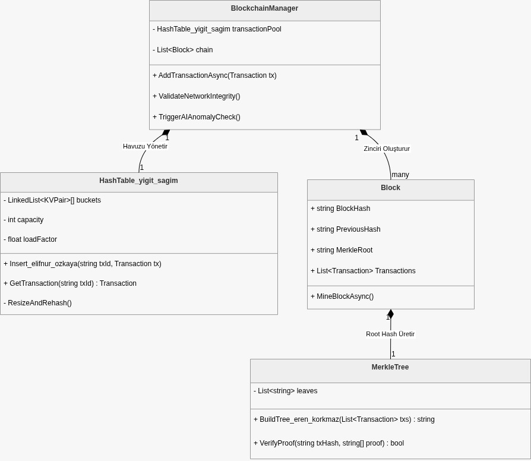
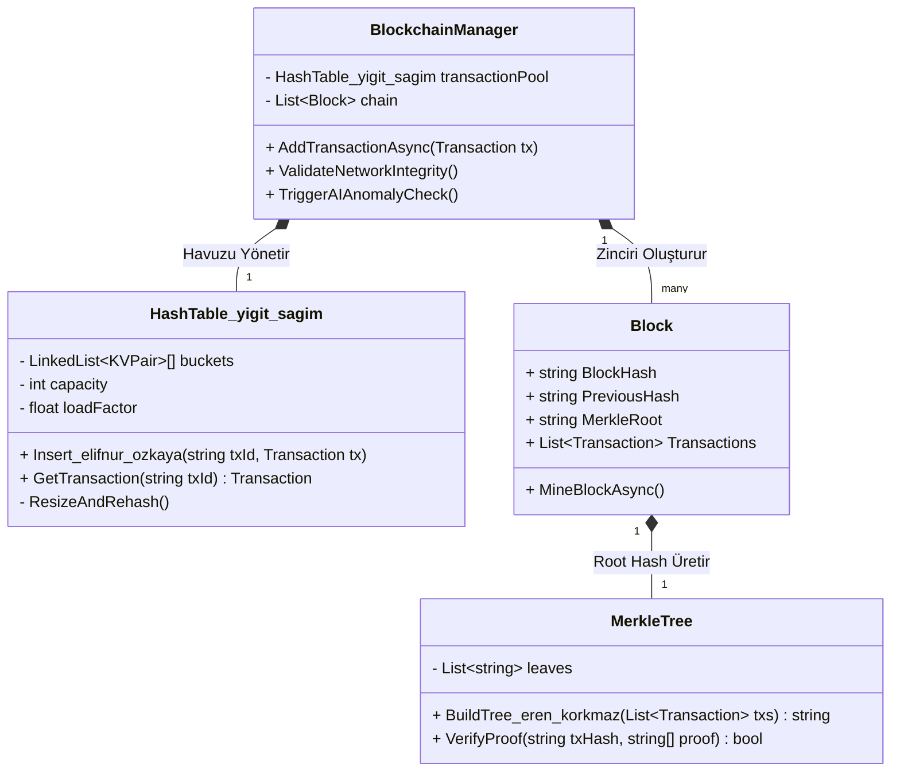

# Proje Raporu ve Analiz: Blokzincir İşlem Ağlarının Analizi

## Projenin Amacı ve Özellikleri
Blokzincir İşlem Ağlarının Analizi projesi, kripto para ağlarındaki cüzdanlar arası karmaşık para transferlerini (transaction) modellemek, analiz etmek ve kullanıcıya görsel bir arayüz ile sunmak amacıyla geliştirilmiştir. Proje, veri yapıları ve algoritmaların (Hash Table, Graf, Merkle Tree vb.) gerçek dünya senaryolarında nasıl kullanılabileceğini kanıtlayan eğitici bir simülasyon görevi görmektedir. 
Sistemimiz, rastgele oluşturulan cüzdanlar ve işlemler üzerinden bir "İşlem Ağı" kurarak; cüzdanlar arası transferlerin izlenmesini (DFS/BFS algoritmaları ile), cüzdan bakiyelerinin net durumunun hesaplanmasını ve işlemlerin kriptografik olarak doğrulanmasını (Merkle Bütünlük Doğrulaması) tek bir platformda birleştirmektedir.

## Kullanılan Teknolojiler
Projede modern web geliştirme standartlarına uygun olarak aşağıdaki teknolojiler kullanılmıştır:
* **C# ve .NET 8 (Backend API):** Uygulamanın beyni olan sunucu tarafı C# ile kodlanmıştır. Tüm özel veri yapıları (Custom Data Structures), arama algoritmaları ve Merkle şifrelemeleri (SHA256) bu katmanda yer alır.
* **React ve TypeScript (Frontend):** Kullanıcı arayüzü, hızlı ve interaktif bir deneyim sunması için React ile geliştirilmiş, tip güvenliği ve hata denetimi için TypeScript kullanılmıştır.
* **Node.js & Vite:** Frontend geliştirme ortamı ve derleme (build) süreçlerinin optimize çalışması için kullanılmıştır.
* **ForceGraph2D:** Cüzdanlar arasındaki karmaşık para transferlerini fizik tabanlı dinamik bir ağ (network) olarak görselleştirmek için kullanılmıştır.
* **Docker & Docker Compose:** Her iki servisin (Frontend ve Backend) tüm bilgisayarlarda sorunsuz ve tek bir komutla ayağa kaldırılabilmesi için projeye entegre edilmiştir.

## 1. Sistem Mimarisi ve Teknolojik Altyapı 



### 1.1. Servis Mimarisi ve Veri Yönetimi
Projemiz, Client-Server (İstemci-Sunucu) mimarisi prensiplerine dayanmaktadır. Sistem temel olarak iki ana servisten oluşmaktadır:
1. **Frontend Servisi (React/Vite):** Kullanıcıyla etkileşime giren, işlem ağını dinamik çizen ve backend ile konuşan görsel katman.
2. **Backend API Servisi (C#/.NET Core):** Uygulamanın iş mantığını yürüten, veriyi işleyen ve saklayan sunucu katmanı.

Backend servisimiz standart **ASP.NET Core Web API (Controllers) şablonu** üzerine inşa edilmiştir. İstemciden (Frontend) gelen HTTP istekleri, `BlockchainController` tarafından karşılanarak doğrudan kendi tasarladığımız veri yapılarına yönlendirilir.

**Veri Depolama (In-Memory Data):**
Sistemimizde bilerek harici bir veritabanı (SQL, MongoDB vb.) kullanılmamıştır. Ağın tüm durumu (Cüzdanlar, İşlemler, Şifrelemeler) uygulamanın çalışma zamanında (Runtime) doğrudan **kendi kodladığımız özel veri yapıları (Hash Table, Transaction Graph, Merkle Tree)** içerisinde RAM (Ana Bellek) üzerinde saklanır. `Program.cs` dosyasında bu veri yapıları sisteme "Singleton" (Dependency Injection) olarak kaydedilir. Böylece uygulamanın her yerinde ve her istekte bellekteki bu tekillik korunur.

### 1.2. Git Versiyon Kontrolü ve İş Akışı
Projenin geliştirilme sürecinde katı bir Git iş akışı (Git Flow) benimsenmiştir. Ana dala doğrudan commit atılmamış, özellikler bağımsız dallarda geliştirilmiştir. Takım üyelerimiz kendi sorumluluk alanlarındaki geliştirmeleri ayrı dallarda tamamlamıştır.
Örneğin; özet tablosu optimizasyonları `hastable-yigit` dalında, blokzincir veri bütünlüğü şifrelemesi ise `feature/merkletree` dalında izole olarak kodlanmış, takım üyelerinin onayından geçen Pull Request mekanizmalarıyla birleştirilmiştir. 

## 2. Takım Görev Dağılımı

Projenin core veri yapıları, ekibin uzmanlık alanlarına göre paylaştırılmış, genel entegrasyon ve altyapı işleri ise ortak yürütülmüştür:

* **Yiğit Sağım:** İşlem havuzundaki verilerin anında aranmasını sağlayan ve çakışmaları çözen **Hash Table (Özet Tablosu)** veri yapısının geliştirilmesini üstlenmiştir.
* **Eren Korkmaz:** Blok içerisindeki binlerce işlemin tek bir kök özetinde şifrelenerek veri bütünlüğünün sağlandığı **Merkle Tree (Merkle Ağacı)** yapısını kodlamıştır.
* **Elifnur Özkaya:** Ağdaki düğümlerin (node) ve işlem akışlarının analiz edilmesi için gerekli olan **Graph (Graf)** veri yapısının kurgulanması ve entegrasyonundan sorumlu olmuştur.
* **Ortak Geliştirme:** C# Backend entegrasyonu, Docker konfigürasyonları, AI API entegrasyonu ve genel sistem mimarisi testleri tüm ekip tarafından ortak olarak yürütülmüştür.

## 3. Proje Mimarisi ve UML Diyagramı

Sistemin temel veri yapılarını, blok yönetimini ve sınıflar arası asenkron ilişkileri gösteren UML diyagramı aşağıdadır:



## 4. Core Veri Yapıları ve Zaman Karmaşıklığı (Big-O) Analizi

Projeyi ölçeklenebilir kılmak adına, hazır .NET kütüphaneleri (List vb.) yerine tamamen kendi tarafımızdan tasarlanmış, spesifik amaçlara hizmet eden özel veri yapıları (Custom Data Structures) kullanılmıştır:

* **WalletHashTable (Cüzdan ve Bakiye Yönetimi):**
    * Cüzdan verilerini bellekte tutmak için Zincirleme (Separate Chaining) yöntemi kullanılmıştır.
    * **Ekleme (Insert) ve Arama (Search):** Ortalama durumda **O(1)** zaman karmaşıklığıyla çalışır. Çakışma (Collision) durumlarında bağlı liste (LinkedList) taraması yapılır (En kötü durum O(N)). 
    * **Genişletme (Rehashing):** Yük katsayısı (Load Factor > 0.75) sınırına ulaşıldığında, tablo boyutu dinamik olarak asal sayılar yardımıyla büyütülür. Bu işlemin anlık maliyeti **O(N)** olsa da, amortize edilmiş analizde ekleme performansı **O(1)** olarak kalmaktadır.

* **TransactionGraph (İşlem Ağı ve Kripto Transferleri):**
    * Cüzdanlar arası kripto para transferlerini modelleyen ve komşuluk listesi (Adjacency List) mantığıyla çalışan yönlü bir graf veri yapısıdır.
    * **Düğüm (Vertex) ve Kenar (Edge) Ekleme:** Sözlük (Dictionary) üzerinden yapıldığı için **O(1)** karmaşıklığındadır.
    * **Ağ Analizi (DFS / BFS):** Bir cüzdandan başlayan para akışını takip etmek için yapılan aramalarda ağdaki tüm düğümler (`V`) ve işlemler (`E`) ziyaret edildiği için zaman karmaşıklığı **O(V + E)**'dir.

* **MerkleTree (Kriptografik Veri Bütünlüğü Doğrulaması):**
    * Sistemdeki tüm işlemlerin özetlerini (Hash) çıkartıp, aşağıdan yukarıya çiftler halinde birleştirerek tek bir Kök (Root) değere ulaşılmasını sağlayan ikili ağaçtır. SHA-256 algoritması kullanılmıştır.
    * **Ağaç Oluşturma (BuildTree):** İşlemler yaprak olarak eklenip birleştirildiğinden zaman karmaşıklığı **O(N)**'dir. Alan (Space) karmaşıklığı da **O(N)**'dir.
    * **Bütünlük Doğrulaması (VerifyIntegrity):** RAM üzerindeki işlemlerin (Transaction) hacklenip hacklenmediğini doğrulamak için mevcut işlemlerden geçici bir Merkle ağacı baştan inşa edilip kök (root) hash değeri bizim ana kökümüzle eşleştirilir (**O(N)**). 

* **CustomStack ve CustomQueue (Bağlantılı Liste Tabanlı Yığıt ve Kuyruk):**
    * Graf üzerindeki arama algoritmalarında (DFS ve BFS) kullanılmak üzere özel olarak yazılmış, Düğüm (Node) bazlı (Linked-List) yapılardır.
    * Her ikisinde de eleman ekleme (`Push`, `Enqueue`) ve çıkarma (`Pop`, `Dequeue`) işlemleri, listenin başı veya sonu referans (pointer) ile tutulduğu için **O(1)** zaman karmaşıklığı ile çalışır. Alan karmaşıklığı ise içindeki eleman sayısı kadar yani **O(N)**'dir.

## 5. AI API'sine Gönderilen Prompt'ların Dökümü 

Projenin entegrasyon ve optimizasyon süreçlerinde büyük dil modellerinden yararlanılmış olup, teknik prompt dökümleri aşağıdadır:

1.  *"C# ile asenkron (Thread-safe) çalışan bir blokzincir kuyruk (mempool) yapısı kuruyoruz. Eşzamanlı işlem isteklerinde (Concurrency) Race Condition oluşmaması için HashTable yapımızı 'lock' mekanizmasıyla veya ConcurrentDictionary prensipleriyle nasıl güvenli hale getirebiliriz?"*
2.  *"Blokzincir ağımızdaki anomalileri tespit etmek üzere tasarladığımız AI servisi ile C# backendimiz Docker network üzerinden iletişim kuracak. Thread'leri bloklamadan HTTP asenkron istek atabilmemiz için en optimize JSON payload mimarisi nasıl olmalıdır?"*
3.  *"Projedeki Merkle Tree algoritmasında, bir bloğa tek sayıda (örneğin 5) işlem geldiğinde son elemanın kendisiyle kopyalanarak hashlenmesi kuralını C# üzerinde temiz kod (Clean Code) prensiplerine uyarak nasıl kurgulayabilirim?"*
4.  *"Jüri değerlendirmesinde Big-O notasyonunu kod üzerinden anlatacağız. Arama süresini O(1) seviyesinde tutmak için kurguladığımız 'Load Factor' ve 'Rehashing' işlemlerinin amortize edilmiş analizini (Amortized Analysis) teknik bir dille açıklar mısın?"*

## 6. Kurulum ve Çalıştırma (Docker Konfigürasyonu)

Farklı teknolojilerle yazılmış Frontend ve C# Backend servislerinin, sistem bağımlılıkları (Node.js, .NET SDK vb.) yaşanmadan tüm bilgisayarlarda çalışabilmesi için mimari `docker-compose.yml` ile izole edilmiştir.

### Kurulum Adımları:
1. Depoyu yerel makinenize klonlayın:
   ```bash
   git clone https://github.com/elifnurozkaya/Blokzincir_Islem_Aglarinin_Analizi.git
   ```
2. Projenin kök dizinine (terminal üzerinden) geçiş yapın:
   ```bash
   cd Blokzincir_Islem_Aglarinin_Analizi
   ```
3. Docker Desktop uygulamasının çalıştığından emin olduktan sonra, servisleri derleyip arka planda başlatmak için aşağıdaki komutu çalıştırın:
   ```bash
   docker-compose up -d --build
   ```
   *(Bu komut, C# Backend API'sini **5084** portunda, React Frontend arayüzünü ise **5173** portunda yayına alacaktır.)*

4. **Uygulamayı Görüntüleme:** 
   İşlem tamamlandıktan sonra web tarayıcınızı açıp aşağıdaki adrese giderek projeyi kullanmaya başlayabilirsiniz:
   👉 **http://localhost:5173**

Sistemi tamamen durdurmak ve kapatmak için aynı dizinde `docker-compose down` komutunu kullanabilirsiniz.
